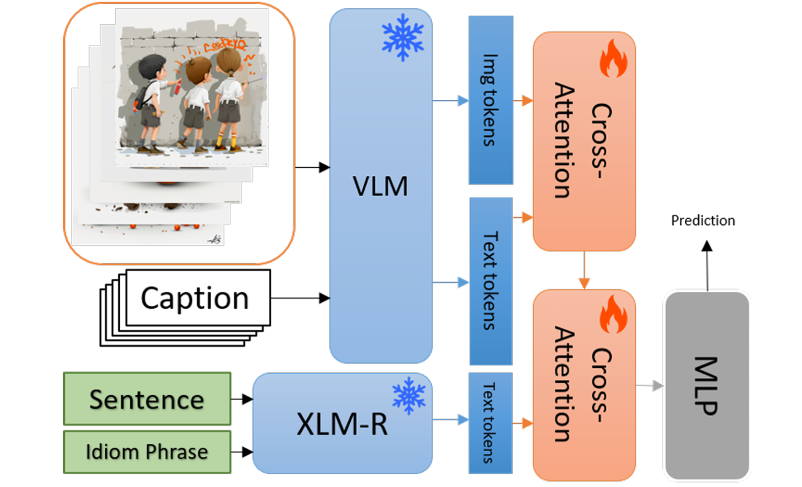

# IMMCAN: Idiom Multimodal Cross-Attention Network

<p align="center">
  
</p>

Official repository for the paper:

**VisAffect at MWE-2026 AdMIRe 2: IMMCAN Idiom Multimodal Cross-Attention Network**

Barış Bilen, Ali Azmoudeh, Hazım Kemal Ekenel, Hatice Köse

---

## Abstract

We address AdMIRe 2.0, a static image ranking task where a sentence containing a potentially idiomatic expression is paired with five image–caption candidates, and the goal is to rank the candidates by semantic compatibility with the intended idiomatic or literal meaning. We propose **IMMCAN**, which keeps **XLM-R** and **Jina-CLIP-v2** frozen and learns a lightweight two-stage cross-attention fusion, consisting of **caption–image grounding** followed by **idiom-to-multimodal conditioning**, to predict a compatibility score per candidate.

We also evaluate caption-only augmentation via back-translation and synonym substitution, and compare regression and rank-class formulations. On **AdMIRe 1.0**, text-only modeling achieves higher test top-image accuracy than VLM-grounded modeling. In contrast, on **AdMIRe 2.0 zero-shot evaluation**, adding visual patch grounding improves both accuracy and NDCG, indicating better cross-lingual ranking transfer.

---

## Code Release

**Code will be released on 1 April 2026.**

This repository will be updated with the implementation, training details, and usage instructions on that date.

---

## Paper

If you use this work, please cite our paper:

```bibtex
@inproceedings{bilen2026visaffect,
  title={VisAffect at MWE-2026 AdMIRe 2: IMMCAN Idiom Multimodal Cross-Attention Network},
  author={Bilen, Bar{\i}{\c{s}} and Azmoudeh, Ali and Ekenel, Haz{\i}m Kemal and Kose, Hatice},
  booktitle={Proceedings of the 22nd Workshop on Multiword Expressions (MWE 2026)},
  pages={149--153},
  year={2026}
}
